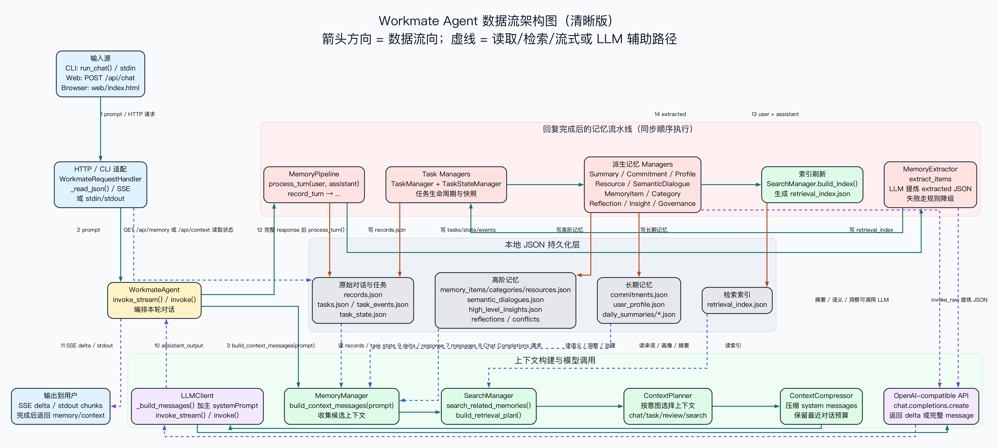

# Workmate Agent

> **一个专注于陪伴和监督长期目标的本地优先、单用户生产力 Agent。**


> 🇺🇸 [English README](README.md)


*(注意：请在此处替换为 Web 界面与调试面板的截图或 GIF 动图)*

## 核心定位 (What It Is)
Workmate Agent 是一个本地优先的生产力搭子。与每次对话都清空上下文的传统聊天机器人不同，Workmate 会围绕你的任务、承诺、专注会话维护**长期持续的状态**。它的设计初衷是在你偏离轨道时进行温和的提醒，帮助你收束注意力，并主动推动长期目标形成闭环。

**项目边界：** 本项目是一个严格本地优先、单用户设计的生产力 Agent，并非通用的 AI 助手或多租户的云端服务。

## 差异化价值 (Why It's Different)
传统的 Chatbot 倾向于把所有的历史对话全部塞进大模型的上下文窗口，这往往会导致“记忆污染”，让 AI 搞不清当前到底什么是真实的。Workmate 解决这个问题的思路是：将**权威状态**（你*现在*正在做什么）与**情景记忆**（我们*过去*聊过什么）进行严格隔离。这种设计让它能像一个真正的同伴一样，跨越数天甚至数周追踪任务进度，而不会产生状态幻觉。

---

## 系统架构 (Architecture)


---

## 核心工程贡献 (Key Engineering Contributions)

### 1. 显式的 Agent 运行时 (Explicit Agent Runtime)
**挑战：** 常规的 LLM 包装器直接将用户输入转发给模型，推理过程是一个无法调试的黑盒。
**方案：** 构建了一条完全可观测的执行链路。每一轮对话都会经过结构化的阶段：上下文规划 (Context Planning) -> 工具规划 (Tool Planning) -> 工具执行 (Tool Execution) -> 模型响应 (Response) -> 记忆写回 (Memory Writeback)。`turn_trace` 会精准记录延迟、工具副作用和记忆更新，而不向用户暴露混乱的底层推理循环。

### 2. 分层记忆与情节 RAG (Hierarchical Memory & Episodic RAG)
**挑战：** 对聊天历史进行纯语义检索 (RAG) 经常会召回过时的信息，从而覆盖掉当前的工作上下文。
**方案：** 将记忆系统按用途划分为：工作记忆 (上下文窗口)、权威状态 (JSON 存储的任务/专注状态)、长期认知 (分层 Markdown) 和情景记忆 (ChromaDB RAG)。RAG 检索综合考虑了时间衰减、显著度、任务相关性，确保 Agent 既能随时掌握你*当前*的焦点，又能随时调取历史上下文。

### 3. 基于 Schema 驱动的工具调用 (Schema-Driven Tool Calling)
**挑战：** 赋予 Agent 不受约束的工具使用权，往往会导致不可预测的外部副作用。
**方案：** 工具被严格限制在仅能操作 Workmate 的内部状态 (任务、记忆、监督偏好)。每一个工具都必须严格声明输入/输出 Schema、读/写权限和预期副作用，并配套写操作审计记录 (audit records) 以及失败时的优雅降级路径。

### 4. 主动的监督闭环状态机 (Proactive Supervision State Machine)
**挑战：** 绝大多数 Agent 都是被动响应式的，只有你主动问，它才工作。
**方案：** 在后台构建了一个调度器 (Scheduler)，持续监测任务停滞、承诺到期和屏幕焦点偏移。这些情况会被转化为监督事件，并由一个严格的状态机管理 (`detected -> notified -> acknowledged/snoozed -> resolved`)。基于视觉的屏幕提醒是瞬时的，不会污染核心的 RAG 数据库。

---

## 能力与代码映射 (Capabilities Evidence)

| 核心能力 | 核心实现代码 | 可观测证据 |
| --- | --- | --- |
| **Agent 运行时** | [`agent/runtime.py`](agent/runtime.py) | `turn_trace`，`OBSERVABILITY SUMMARY` |
| **分层记忆** | [`memory/knowledge.py`](memory/knowledge.py), [`memory/context_engine.py`](memory/context_engine.py) | `memory/data/knowledge/*.md`，Web Debug 面板 |
| **情节 RAG** | [`memory/search.py`](memory/search.py), [`memory/retriever.py`](memory/retriever.py) | 检索计划，打分拆解，来源引用 |
| **工具调用** | [`tools/registry.py`](tools/registry.py), [`tools/executor.py`](tools/executor.py) | Tool Schema，Tool Trace，审计记录 |
| **主动监督循环** | [`memory/supervision_events.py`](memory/supervision_events.py) | 事件状态机，Scheduler 滴答日志 |
| **视觉陪伴** | [`src/LLMClient.py`](src/LLMClient.py) | 瞬时屏幕提醒记录 |
| **API 契约** | [`src/web.py`](src/web.py) | `/docs`，`/openapi.json` |
| **自动化评估** | [`evals/run_eval.py`](evals/run_eval.py), [`evals/cases.json`](evals/cases.json) | Markdown / JSON 评估报告 |

---

## 快速开始 (Quick Start)

### 前置要求 (Prerequisites)
- **Python:** 3.12+
- **环境管理:** 强烈推荐使用 `conda`

### 安装 (Installation)
克隆仓库并配置环境变量：
```bash
git clone https://github.com/fcsfang/workmate-agent.git
cd workmate-agent
cp .env.example .env
```

在 `.env` 中填写你的 OpenAI 兼容模型配置：
```env
LLM_MODEL_ID=moonshotai/kimi-k2.6:free
LLM_API_KEY=your-api-key-here
LLM_BASE_URL=https://openrouter.ai/api/v1
```

### 运行 Agent (Run)
启动脚本会自动优先使用 `agent` conda 环境，安装依赖，启动 FastAPI 服务，并自动在浏览器中打开 Web 界面。

```bash
./run.sh
```

- **Web 界面:** `http://127.0.0.1:7860`
- **OpenAPI 文档:** `http://127.0.0.1:7860/docs`
- **自定义端口:** `WORKMATE_PORT=7861 ./run.sh`
- **停止服务:** 在运行终端按 `Ctrl+C`

*(注意：Vision 屏幕追踪、系统推送和 TTS 均为可选功能，请在 `.env` 中配置。API Key、本地向量索引和截图默认被 Git 忽略，以保护隐私)。*

---

## 可复现 Demo 模式 (Reproducible Demo Mode)
在面试演示或录屏前，你可以生成一套包含完整生命周期的无隐私数据：
```bash
python scripts/reset_demo_data.py
./run.sh
```
该脚本会先备份你的真实数据，然后注入一套包含任务生命周期、承诺、RAG 历史和监督事件的演示数据，方便你全方位展示 Agent 的各项能力。

---

## 测试与评估 (Testing & Evaluation)
本项目包含完善的评估套件和 CI 流程。

```bash
# 运行单元与集成测试
conda run -n agent pytest

# 运行可复现的自动化评估
conda run -n agent python evals/run_eval.py

# 基础语法与类型检查
conda run -n agent python -m py_compile agent/*.py memory/*.py src/*.py tools/*.py tests/*.py
```
评估报告会自动生成在 `evals/reports/` 目录下，涵盖了意图分类、RAG 召回率、任务管理逻辑以及 OpenAPI 冒烟测试。GitHub Actions 会在每次推送和 Pull Request 时自动执行这些核心检查。

---

## 项目结构 (Project Structure)
```text
workmate-agent/
├── agent/                  # Agent 核心运行时与执行追踪
├── memory/                 # 分层状态管理、RAG 检索与监督逻辑
│   └── data/               # 本地运行时数据 (不提交至 Git)
├── tools/                  # Tool Registry 与内部状态操作工具
├── src/                    # LLM 客户端、命令行工具与 FastAPI 应用
├── web/                    # 本地 Web 调试界面
├── evals/                  # 固定的测试用例集与本地评估报告
├── tests/                  # Pytest 测试套件
├── scripts/                # Demo 数据生成与工程脚本
└── docs/                   # 架构讲解文档与开发路线图
```

## 文档指引 (Documentation Links)
- [Architecture Walkthrough](docs/ARCHITECTURE_WALKTHROUGH.md): 详细的 Agent Loop 架构图、RAG 设计和状态机流转讲解。
- [CHANGELOG](CHANGELOG.md): 版本里程碑与核心设计演进记录。
- [Goal Mode Roadmap](docs/GOAL_MODE_ROADMAP.md): 后续工程化的迭代计划。
- [Development Plan](docs/DEVELOPMENT_PLAN.md): Agent 工程能力的早期架构蓝图。
