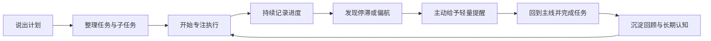

# Workmate Agent

> **一个会持续记住目标、关注执行进度，并在注意力偏离时轻轻拉你回来的生产力搭子。**


[](https://github.com/fcsfang/workmate-agent/actions/workflows/ci.yml)

[English README](readme.md)


## 产品愿景

很多计划并不是因为能力不足而失败，而是在日常工作中逐渐失去关注：任务被新的消息打断，进度没有及时回顾，几天后连自己最初准备做什么都变得模糊。

Workmate Agent 希望成为一个能够长期陪伴用户行动的个人生产力 Agent。它不替用户完成具体工作，而是持续记住目标、整理计划、追踪进展、守护注意力，并在合适的时候给予温和提醒，帮助用户把长期计划真正推进下去。

它服务的最终目标是：**提高生产力、专注度和自我管理能力，让“准备去做”更容易变成“持续在做”和“最终完成”。**

## 它解决什么问题

普通聊天助手通常在回答结束后就停止工作，待办工具则需要用户主动维护。Workmate Agent 关注的是两者之间缺少的执行过程：

- 用户说过的计划能够被长期记住，而不是随着聊天窗口关闭而消失。
- 一项大目标可以被整理为任务和子任务，并随着汇报持续更新。
- 用户离开页面后，Agent 仍能关注任务停滞、承诺到期和专注状态。
- 当屏幕内容偏离当前目标时，Agent 可以理解实际情境，而不是机械地按应用名称判断。
- 提醒以低压力、少打扰为原则，帮助用户重新聚焦，而不是制造新的焦虑。

## 使用闭环



Workmate Agent 的价值不在某一次回复，而在这个闭环能够跨越多轮对话、多个工作阶段持续运行。


## 核心体验

### 1. 计划说一次，后面持续接着做

用户只需要自然地表达计划。Agent 会识别主任务、子任务、当前进度和下一步，并在后续对话中继续沿用这些状态。刷新页面或重新打开应用后，仍然可以回到原来的工作主线。

### 2. 从任务建立到完成的全程跟踪

任务不是一条静态待办，而是拥有进行中、阻塞、完成和放弃等状态的执行对象。用户每次汇报进度时，Agent 会更新对应任务，而不是重新创建一组互不相关的记录。

### 3. 主动监督，而不只是被动聊天

后台监督会关注专注会话、长时间未更新的任务和即将到期的承诺。需要提醒时，消息会进入页面、系统通知或语音渠道；用户也可以确认、稍后提醒、静音或关闭事件。

### 4. 理解屏幕内容的注意力陪伴

可选的视觉监督会结合当前目标、屏幕截图和近期观察，判断用户是在推进任务、临时查资料，还是已经偏离主线。它可以在相关工作中保持安静，也可以在用户主动检查时给出即时反馈。


### 5. 低压力的陪伴方式

Workmate Agent 默认先帮助用户记住和整理，不强制要求完成证明，也不会每次都用追问结束回复。当效率可能下降时，它只提供一个足够小的建议，把行动空间留给用户。

### 6. 面向长期使用的记忆

当前任务和承诺以明确状态保存；稳定目标、偏好和行为模式被整理为长期认知；历史对话只在相关时检索。这样既能延续上下文，也尽量避免旧信息覆盖当前事实。

## 一段典型对话

用户：

> 我准备周五做一次《深度工作》的读书分享。需要读完剩余章节、整理分享提纲，再做一份简单的演示文稿。我现在先读书和整理笔记。

Workmate Agent 会整理出一个主任务和三个子任务，并把阅读设为当前行动。

一段时间后，用户可以继续汇报：

> 我读完了第三章，整理了注意力残留和固定工作节奏的笔记，还剩最后两章。

Agent 会更新原任务的进度，并保留下一步。开始专注会话后，如果用户长时间停留在无关页面，视觉监督可以结合屏幕内容进行轻量提醒；如果用户正在阅读原书，则保持安静或给出陪伴反馈。

## 数据与隐私

Workmate Agent 面向本地单用户使用。任务、对话、用户画像、长期认知和向量索引默认保存在本机，不会提交到 Git。

需要注意：模型推理仍可能使用你配置的外部 API。普通对话会把必要上下文发送给语言模型；启用视觉监督后，临时屏幕截图会发送给视觉模型进行分析，并在调用结束后从本地删除。请根据所选服务商的隐私政策决定是否启用相关能力。

你可以随时清除全部本地记忆：

```bash
# 先在运行终端按 Ctrl+C 停止服务
./scripts/clear_memory.sh
```

脚本会删除对话、任务、画像、长期认知、屏幕观察、向量索引和历史备份，但不会删除 `.env`、项目代码和通用方法论知识库。

## 快速开始

### 环境要求

- Python 3.12+
- 推荐使用 Conda，也支持自动创建本地 `.venv`

### 安装与配置

```bash
git clone https://github.com/fcsfang/workmate-agent.git
cd workmate-agent
cp .env.example .env
```

在 `.env` 中填写 OpenAI 兼容模型配置：

```env
LLM_MODEL_ID=moonshotai/kimi-k2.6:free
LLM_API_KEY=your-api-key-here
LLM_BASE_URL=https://openrouter.ai/api/v1
```

### 启动

```bash
./run.sh
```

启动脚本会检查运行环境、安装依赖、启动 FastAPI 服务并自动打开浏览器。

- Web 页面：`http://127.0.0.1:7860`
- OpenAPI 文档：`http://127.0.0.1:7860/docs`
- 自定义端口：`WORKMATE_PORT=7861 ./run.sh`
- 停止服务：在运行终端按 `Ctrl+C`

首次启动时，Workmate 会从一个干净的工作台开始，等待用户汇报当前计划和进度：


视觉监督、系统通知和讯飞 TTS 均为可选能力，可以在 `.env` 和页面设置中单独开启。

## 为什么它是一个 Agent

Workmate Agent 不只是把输入转发给大模型。每轮交互都会结合当前状态和相关记忆，判断是否需要调用内部工具，再将结果写回任务、承诺和记忆系统。后台调度器还会在没有新消息时主动检查监督条件。

产品体验背后的主要能力包括：

- 可观察的 Agent 执行链路；
- 分层长期记忆与历史检索；
- 用于内部状态管理的工具调用；
- 主动监督事件生命周期；
- FastAPI 与 OpenAPI 接口；
- 自动化测试与固定评估集。

这些工程细节不会占据日常界面，需要深入了解时可以查看架构文档。

## 工程验证

```bash
# 单元与集成测试
conda run -n agent pytest

# 固定评估集
conda run -n agent python evals/run_eval.py
```

评估覆盖意图识别、任务跟踪、记忆召回、工具调用和监督生命周期。GitHub Actions 会在推送和 Pull Request 时运行核心检查。

## 深入了解

- [架构讲解](docs/ARCHITECTURE_WALKTHROUGH.md)：Agent Loop、记忆、工具和监督流程。
- [版本记录](CHANGELOG.md)：主要版本能力与设计演进。
- [开发路线](ROADMAP.md)：后续产品与工程计划。
- [Goal Mode Roadmap](docs/GOAL_MODE_ROADMAP.md)：持续目标模式的阶段规划。

## 项目边界

Workmate Agent 当前是一个本地优先、单用户的个人生产力 Agent，不是通用问答助手，也不是多租户云服务。它不会替用户完成所有工作；它更关心用户现在准备做什么、是否仍在主线上，以及怎样让计划更有机会被持续完成。
