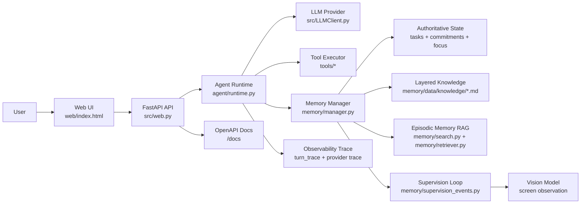
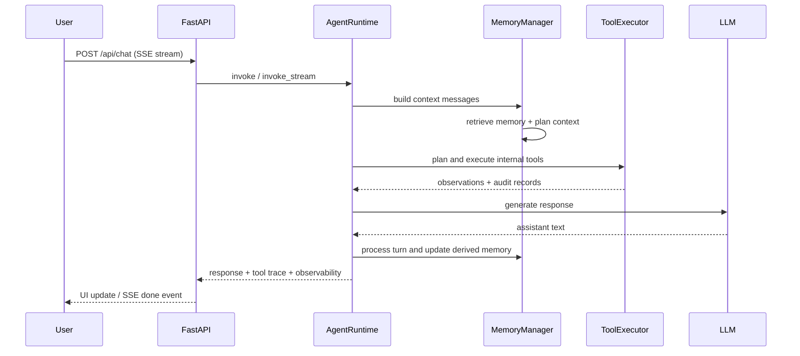
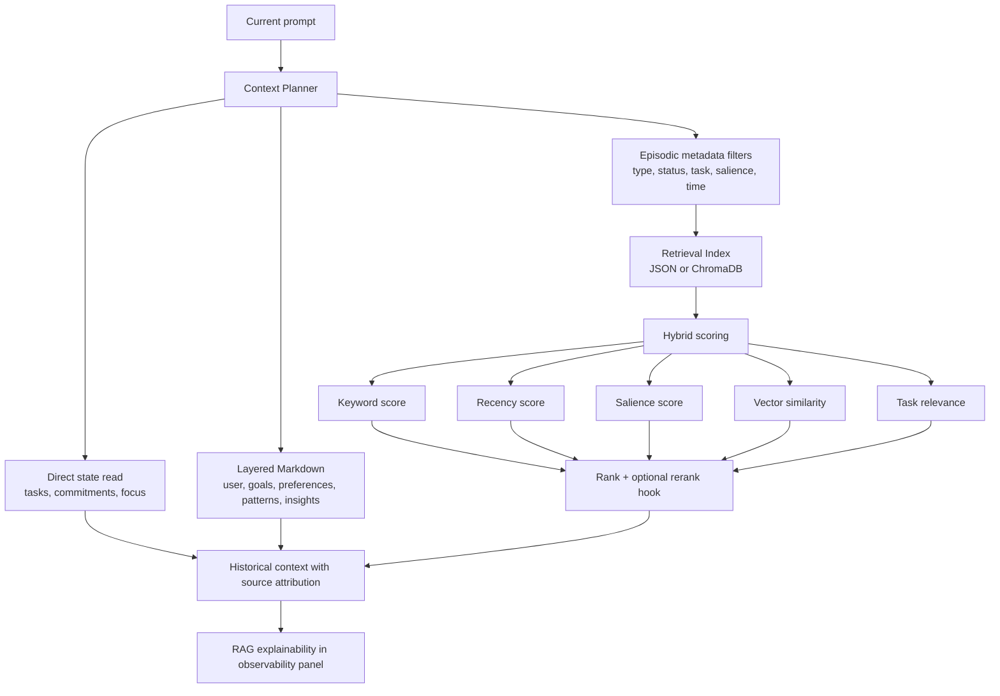
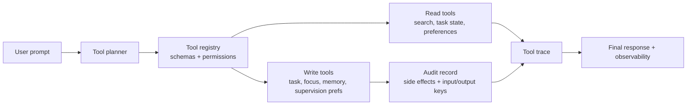
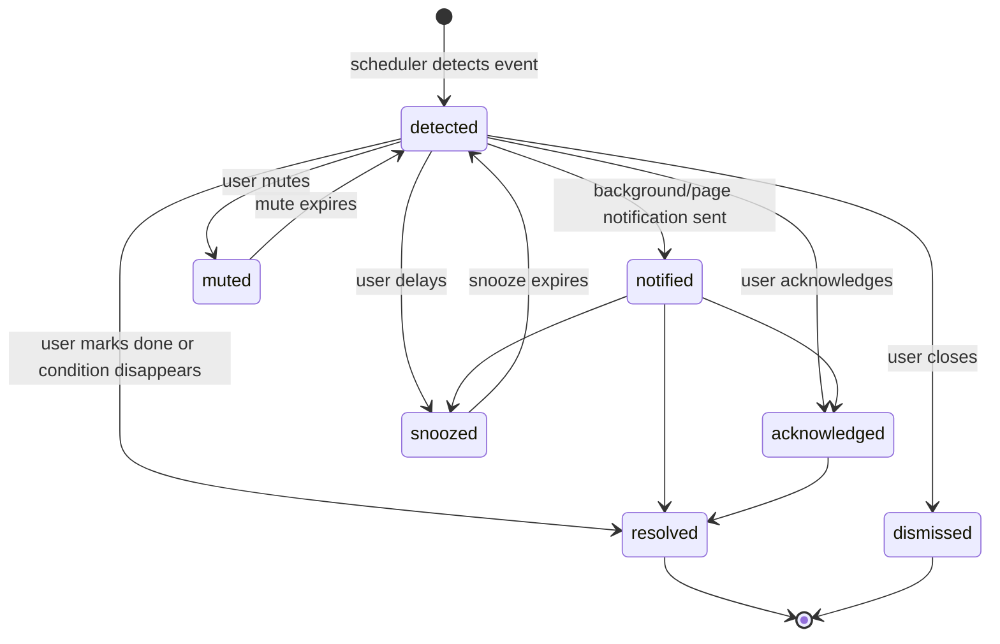

# Workmate Agent Architecture Walkthrough

This document is the technical companion to the product-focused README. It helps a reviewer inspect the agent runtime, memory boundaries, internal tools, proactive supervision, OpenAPI schema, and evaluation flow.

## One-line Positioning

Workmate Agent is a local-first productivity agent with explicit runtime orchestration, hybrid memory RAG, schema-driven internal tools, multimodal screen supervision, observable traces, and reproducible evaluation.

## What To Show First

1. Run `./scripts/clear_memory.sh` if a clean state is needed, then start with `./run.sh`.
2. Open `http://127.0.0.1:7860`, describe a real plan, and show how the conversation becomes a task with subtasks and a next action.
3. Open `http://127.0.0.1:7860/docs` and show typed FastAPI contracts.
4. Open the eval report generated by `python evals/run_eval.py --report-dir /tmp/workmate-eval-reports` when validation is allowed.

## System Architecture



Key point: the project is not only a chat wrapper. The runtime coordinates memory retrieval, tool planning, state updates, supervision events, and trace generation around every turn.

## Agent Loop



What to say: each turn produces a visible execution trace. Tool decisions, RAG decisions, provider calls, and memory writeback are observable instead of hidden inside a single API call.

## Hierarchical Memory and Episodic RAG



What to say: current execution state is never guessed through vector search. Stable cognition is readable Markdown, while RAG is reserved for historical episodes and remains explainable through metadata, attribution, score breakdown, and optional vector search.

## Tool Calling Layer



What to say: tools are used for internal state management rather than arbitrary external actions. This keeps the project focused and auditable while still demonstrating schema-driven tool use.

## Proactive Supervision Loop



What to say: supervision is a state machine with transition history and reasons. Screen observations stay lightweight: Vision reminders are visible as transient messages but do not pollute long-term memory.

## 3-5 Minute Technical Walkthrough

### 0:00-0:40 Setup

Run:

```bash
./scripts/clear_memory.sh --yes
./run.sh
```

Say: "This clears local runtime memory and starts the single-user agent from an empty state. Private `.env`, conversations, screen observations, and local indices are not committed."

### 0:40-1:30 Product Surface

Open `http://127.0.0.1:7860`.

Show:

- The plan becoming a task and subtasks.
- Streamed response and persistent conversation history.
- Current progress, next action, focus session, and supervision events.

Say: "This is a productivity agent for focus and self-supervision, but the engineering focus is the full agent loop behind it."

### 1:30-2:20 Agent Runtime And Tools

Send a short message such as:

```text
我准备周五做一次读书分享。今天先读完剩余章节并整理笔记，之后再写提纲和演示文稿。
```

Show:

- Streamed response.
- Tool trace / planner information.
- Observability summary.

Say: "The agent can plan internal state tool calls and every call includes schema, read/write mode, side effects, and failure recovery hints."

### 2:20-3:10 Memory RAG

Open `http://127.0.0.1:7860/?debug=1` only for this engineering explanation.

Show:

- Retrieval plan.
- Score breakdown.
- Source attribution.
- Injected context reason.

Say: "The memory system combines keyword, recency, salience, vector similarity, and task relevance, then reports why each memory entered the context."

### 3:10-4:00 Supervision

Start a focus session, click the manual screen-observation button, and switch to another prepared window during the countdown. Return to show the Vision-generated transient message and the supervision event controls.

Say: "Proactive supervision is not a repeated notification loop. It is a lifecycle state machine with transitions, feedback stats, adaptive strategy explanations, and scheduler boundaries."

### 4:00-5:00 Engineering Evidence

Open:

```text
http://127.0.0.1:7860/docs
```

Optionally open the eval report after running evals when validation is allowed.

Say: "The project exposes typed OpenAPI contracts and has reproducible eval categories for intent, memory recall, tool calling, supervision lifecycle, observability, and API schema smoke checks."

## Resume Bullets

- Built a local-first productivity agent with FastAPI, streaming chat, hybrid memory RAG, tool calling, proactive supervision, and multimodal screen observation.
- Implemented an observable agent runtime with provider traces, RAG explainability, tool execution traces, side-effect auditing, and reproducible eval reports.
- Designed a supervision state machine connecting task lifecycle, focus sessions, commitments, screen observations, reminder preferences, and user feedback.
- Packaged the project with one-command startup, local-memory cleanup, OpenAPI docs, product media, and an interview-ready architecture walkthrough.
