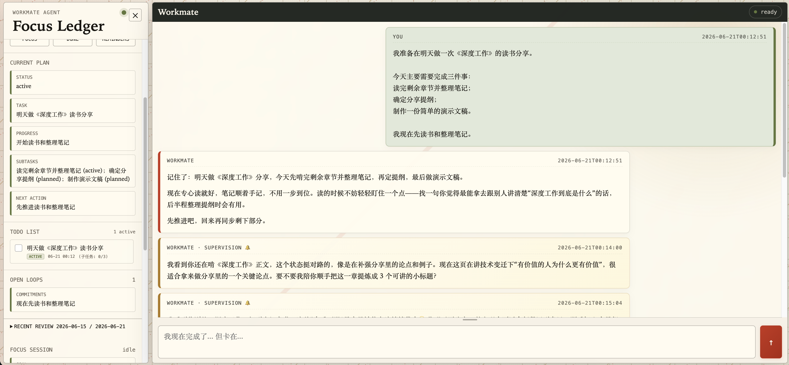
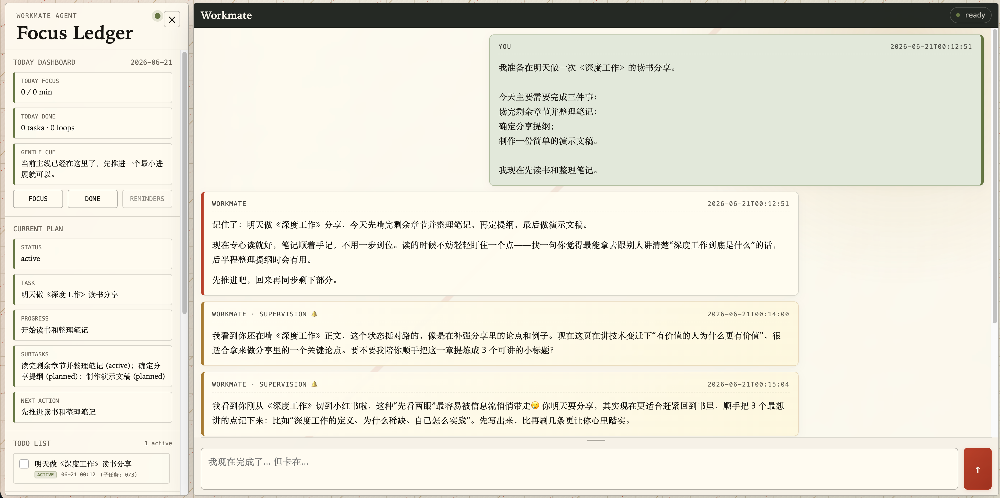
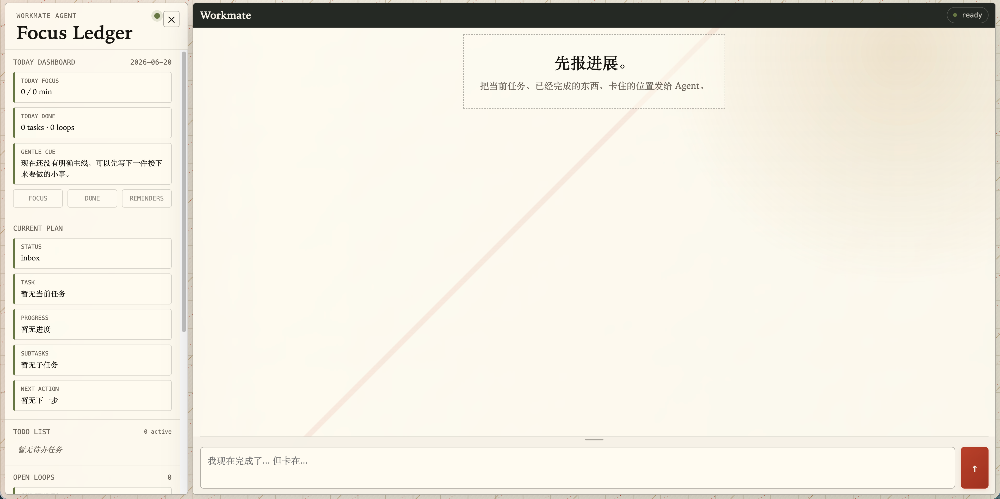

# Workmate Agent

> **让每一个长期目标，都持续有人记得。**

Workmate Agent 是一个本地优先的个人生产力 Agent。  
它持续理解你的长期目标、当前任务、屏幕行为和注意力状态，在任务停滞、承诺临近或行为偏航时主动出现，帮助你把零散投入沉淀为稳定进展。

它不是又一个 Todo App，也不是一个只会被动回答问题的聊天机器人。  
Workmate 更像一个长期在场的工作搭子：记得你要完成什么，观察你是否还在主线上，并在你快要掉线时把你拉回来。


[](https://github.com/fcsfang/workmate-agent/actions/workflows/ci.yml)

[English README](readme.md) · [快速开始](#快速开始) · [数据与隐私](#数据与隐私) · [架构讲解](docs/ARCHITECTURE_WALKTHROUGH.md)


## 为什么需要 Workmate？

很多长期目标不是因为不会做而失败。

它们往往失败在更日常、更隐蔽的地方：

- 今天推进了一点，但明天忘了接着做什么；
- 和 AI 聊过计划，但下一次对话又从零开始；
- Todo 里写着任务，却没有人持续关心它是否真的发生；
- 明明知道目标重要，却在一次次临时切换中慢慢偏航；
- 想提高专注度和生产力，却缺少一个持续反馈行动状态的系统。

传统 Todo 工具擅长保存“要做什么”。  
普通聊天机器人擅长回答“现在问什么”。  

但长期目标真正需要的是一个持续闭环：

**记得目标 → 看见行动 → 识别偏航 → 主动提醒 → 回到主线。**

Workmate Agent 正是围绕这个闭环构建的个人生产力 Agent。

## 它想成为怎样的 Agent？

Workmate 的愿景不是替用户完成一切，也不是简单地催促用户做事。

它希望成为一个长期在场的个人生产力伙伴：

- 持续记得用户真正想完成的长期目标；
- 理解用户此刻正在做什么；
- 判断当前行为是否正在推进任务；
- 在任务停滞、注意力偏航或承诺临近时及时介入；
- 帮助用户逐步建立更稳定、更自律的行动节奏。

它关注的不只是一次任务有没有完成，而是用户能不能在长期目标上持续保持方向感、专注度和行动力。

## 核心体验

### 1. 目标不会掉线

计划一旦交给 Workmate，就不再只是一句话。

Workmate 会持续维护任务状态：主任务、子任务、当前进展、阻塞原因、下一步行动和未关闭承诺都会被结构化保存。

因此，即使刷新页面、重启服务，或者隔几天重新回来，任务仍然可以从原来的位置继续。

你不需要重新解释：

- 我之前做到哪里了；
- 这个任务为什么重要；
- 下一步应该干什么；
- 哪些承诺还没有完成。

长期目标因此不再依赖临时热情，而是拥有一条可以被持续接上的主线。



### 2. 行动真的被看见

真正决定目标是否推进的地方，往往不是聊天窗口，而是屏幕。

Workmate 的视觉监督模块会结合当前目标理解屏幕内容。  
它不只判断用户打开了什么应用，还会分析眼前活动是否正在推进当前任务，并结合近期轨迹区分一次临时切换和持续偏航。

**当前目标 × 屏幕语义 × 行为轨迹 → 静默、同行或拉回。**

当你正在正常推进任务时，它保持安静。  
当你进入与目标相关的工作场景时，它可以提供同行式反馈。  
当你长时间偏离当前目标时，它会生成一次可追踪的监督事件。


<details>
<summary>查看清晰的视觉监督消息</summary>



</details>

### 3. 注意力偏航时，及时拉回

Workmate 不只是记录任务，也会关注任务和行为之间是否发生了断裂。

它会持续观察几类信号：

- 当前任务是否长时间没有推进；
- 用户是否持续停留在与目标无关的屏幕活动中；
- 专注时段是否已经结束；
- 承诺是否临近或逾期；
- 最近行为轨迹是否显示出持续偏航。

这些信号会被转化为可追踪的监督事件，并进入完整生命周期：  
创建、提醒、确认、延后、关闭或完成。

这样，目标不会悄无声息地被日常事务覆盖，注意力也不会在无感切换中逐渐丢失。

### 4. 每一次投入，都留下积累

Workmate 保存的不只是对话记录。

它会把不同层次的信息分开沉淀：

- 短期对话上下文；
- 任务状态与任务事件；
- 长期目标与用户画像；
- 重复出现的行为模式；
- 阶段性反思与高阶洞察；
- 可检索的历史记忆与向量索引。

过去的经历只在真正相关时重新进入上下文。  
这让每一次使用都不是孤立聊天，而是在已有主线上的继续推进。

## 技术实现

Workmate Agent 的产品体验由一套完整的 Agent 运行链路支撑：

- **分层记忆系统**：区分短期上下文、任务状态、长期画像、阶段反思与向量记忆；
- **任务生命周期管理**：维护任务、子任务、进展、阻塞、下一步与事件流；
- **Schema 驱动的内部状态工具**：让 Agent 可以结构化地读写任务和记忆，而不是只生成自然语言；
- **主动监督事件机制**：将停滞、偏航、承诺临近等信号转化为可追踪事件；
- **多模态屏幕理解**：通过视觉模型分析当前屏幕与目标之间的关系；
- **本地优先架构**：任务、记忆、索引和运行数据默认保存在本机；
- **FastAPI 服务层**：提供 Web 交互、流式响应和 OpenAPI 接口；
- **自动化测试与固定评估集**：用于验证 Agent 行为在不同场景下的稳定性。

```bash
conda run -n agent pytest
conda run -n agent python evals/run_eval.py
```

[架构讲解](docs/ARCHITECTURE_WALKTHROUGH.md) · [版本记录](CHANGELOG.md)

## 数据与隐私

Workmate 默认以本地优先方式运行。

- 任务、对话、画像、长期认知和向量索引默认保存在本机；
- 使用外部模型时，必要上下文会发送给所配置的模型服务商；
- 启用视觉监督后，临时截图会发送给视觉模型，并在分析完成后从本地删除；
- API Key、运行时记忆、屏幕截图和本地索引不会提交到 Git。

你可以随时清除全部本地记忆：

```bash
# 先停止正在运行的 Workmate
./scripts/clear_memory.sh
```

## 快速开始

要求 Python 3.12+。  
推荐使用 Conda，也支持自动创建本地 `.venv`。

```bash
git clone https://github.com/fcsfang/workmate-agent.git
cd workmate-agent
cp .env.example .env
```

在 `.env` 中填写 OpenAI 兼容模型配置：

```env
LLM_MODEL_ID=moonshotai/kimi-k2.6:free
LLM_API_KEY=your-api-key-here
LLM_BASE_URL=https://openrouter.ai/api/v1
```

启动服务：

```bash
./run.sh
```

默认地址：

- Web 页面：`http://127.0.0.1:7860`
- OpenAPI：`http://127.0.0.1:7860/docs`
- 自定义端口：`WORKMATE_PORT=7861 ./run.sh`
- 停止服务：在运行终端按 `Ctrl+C`

<details>
<summary>查看初始化界面</summary>



</details>

## 项目边界

Workmate 当前是一个本地优先、单用户的个人生产力 Agent。

它不会替用户完成所有具体工作，也不是一个通用自动化执行器。  
它更像一个长期目标的“在场者”：持续记得主线、观察行动状态，并在目标即将掉线时提醒用户把它接回来。

它的目标不是简单制造更多提醒，而是帮助用户在长期目标上保持方向感、专注度和行动力。