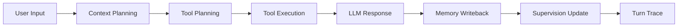

# Workmate Agent

Workmate Agent 是一个 **local-first productivity agent**。它围绕任务、承诺、专注会话和屏幕活动维护长期状态，通过分层记忆、受控工具调用和主动监督，帮助用户持续推进目标，而不只是完成一轮问答。

> 当前版本：V2.9.0 · Python 3.12 · FastAPI · ChromaDB · OpenAI-compatible API

项目愿景是让 Agent 能在较长周期内理解用户的目标与执行节奏，在合适的时候温和提醒偏航、帮助收束注意力，并推动任务形成闭环。它强调陪伴与监督，而不是替用户完成具体工作。

## 项目亮点

### 1. 显式 Agent Runtime

每轮交互都经过可观察的执行链路，而不是直接把用户输入转发给模型：



`turn_trace` 记录阶段耗时、模型调用、RAG 决策、工具副作用和记忆写回结果，不暴露模型隐藏推理链。

### 2. 分层记忆与 Episodic RAG

记忆系统按用途划分，避免让模糊检索结果覆盖当前状态：

| 层级 | 内容 | 机制 |
| --- | --- | --- |
| 工作记忆 | 最近对话与当前输入 | 上下文窗口 |
| 权威状态 | 任务、承诺、专注会话、监督事件 | JSON 直接读取 |
| 长期认知 | 用户、目标、偏好、模式、洞察 | 分层 Markdown |
| 情景记忆 | 历史对话、摘要、语义片段 | ChromaDB / JSON Hybrid RAG |

RAG 支持关键词、时间衰减、显著度、向量相似度、任务相关性、metadata filter、source attribution、增量索引和可替换 reranker。检索计划会明确展示召回原因与评分拆解。

### 3. Schema-driven Tool Calling

工具只操作 Workmate 内部状态，覆盖任务、承诺、专注会话、记忆和监督偏好。每个工具声明：

- 输入与输出 schema
- 只读或写入权限
- 可预期副作用
- planner 决策来源
- 写操作 audit record
- 可恢复错误与降级建议

### 4. 主动监督闭环

后台 scheduler 将任务停滞、承诺到期、专注超时和屏幕偏航转为监督事件，并通过状态机管理：

```text
detected → notified → acknowledged / snoozed / muted → resolved / dismissed
```

事件保留迁移历史和用户反馈。Vision 屏幕提醒使用 transient messages，不写入长期对话记忆，避免观察数据污染画像和 RAG。

### 5. 可观察与可评估

- FastAPI `/docs` 暴露强类型 OpenAPI 合同
- Web `MODEL CONTEXT` 展示上下文、RAG、工具和 provider trace
- Evaluation Suite 覆盖意图、记忆召回、任务、承诺、工具与监督状态机
- pytest 与 GitHub Actions 自动执行语法检查、测试和 eval smoke test
- 本地数据支持 inventory 与带 manifest 的 ZIP 导出

## 能力证据

| 能力 | 核心代码 | 可见证据 |
| --- | --- | --- |
| Agent Runtime | `agent/runtime.py` | `turn_trace`、`OBSERVABILITY SUMMARY` |
| Hierarchical Memory | `memory/knowledge.py`, `memory/context_engine.py` | `memory/data/knowledge/*.md`、Model Context |
| Episodic RAG | `memory/search.py`, `memory/retriever.py` | retrieval plan、score breakdown、citation |
| Tool Calling | `tools/registry.py`, `tools/executor.py` | tool schema、tool trace、audit record |
| Supervision Loop | `memory/supervision_events.py` | event state、transition history、scheduler tick |
| Vision Companion | `src/LLMClient.py`, `memory/supervision_events.py` | transient screen reminders、provider trace |
| API Contract | `src/web.py` | `/docs`、`/openapi.json` |
| Evaluation | `evals/run_eval.py`, `evals/cases.json` | Markdown / JSON eval report |

## 快速开始

```bash
git clone https://github.com/fcsfang/workmate-agent.git
cd workmate-agent
cp .env.example .env
```

在 `.env` 中填写 OpenAI-compatible 模型配置：

```env
LLM_MODEL_ID=moonshotai/kimi-k2.6:free
LLM_API_KEY=your-api-key-here
LLM_BASE_URL=https://openrouter.ai/api/v1
```

一键启动：

```bash
./run.sh
```

脚本会优先使用 conda `agent` 环境，否则创建本地 `.venv`，安装依赖、启动 FastAPI 并自动打开浏览器。

- Web：`http://127.0.0.1:7860`
- OpenAPI：`http://127.0.0.1:7860/docs`
- 自定义端口：`WORKMATE_PORT=7861 ./run.sh`
- 停止服务：在运行终端按 `Ctrl+C`

Vision、系统推送和讯飞 TTS 均为可选能力，配置项见 [.env.example](.env.example)。API Key、运行记忆、截图和本地向量索引默认不会提交到 Git。

## 可复现 Demo

面试或录屏前可以生成一套不包含私人数据的演示状态：

```bash
python scripts/reset_demo_data.py
./run.sh
```

脚本会先备份现有 `memory/data`，再生成任务生命周期、承诺、专注会话、RAG、监督事件、长期认知和 transient Vision 提醒等演示数据。

建议按以下顺序展示：

1. 在聊天区汇报一个任务计划。
2. 查看任务、承诺和专注状态更新。
3. 打开 `MODEL CONTEXT` 查看 RAG 与 tool trace。
4. 在监督事件中演示 snooze、resolve 或 dismiss。
5. 打开 `/docs` 展示 API schema。

完整讲解脚本见 [Architecture Walkthrough](docs/ARCHITECTURE_WALKTHROUGH.md)，真实交互案例见 [demo.md](demo.md)。

## 测试与评估

```bash
# 单元与集成测试
conda run -n agent pytest

# 可复现评估
conda run -n agent python evals/run_eval.py

# 基础语法检查
conda run -n agent python -m py_compile agent/*.py memory/*.py src/*.py tools/*.py tests/*.py
```

评估报告生成在 `evals/reports/`，包括分类指标、失败用例、RAG 召回证据、observability trace 和 OpenAPI schema smoke results。GitHub Actions 在 push 和 pull request 时运行相同的核心检查。

## 核心结构

```text
workmate-agent/
├── agent/                  # Agent Runtime 与 turn trace
├── memory/                 # 状态、分层认知、RAG、反省与监督
│   └── data/               # 本地运行数据，不提交 Git
├── tools/                  # Tool registry、executor 与内部状态工具
├── src/                    # LLM client、CLI 与 FastAPI 应用
├── web/                    # 本地调试界面
├── evals/                  # 固定评估集、runner 与本地报告
├── tests/                  # pytest 测试
├── scripts/                # Demo 数据与工程脚本
└── docs/                   # 架构讲解和开发路线
```

## 项目边界

Workmate Agent 负责总体规划、状态记忆和温和监督，不替用户深入完成专业任务。工具层当前聚焦内部状态管理，不执行任意外部操作；系统为单用户、本地优先设计，尚未提供多租户账户、跨设备同步或生产级云部署。

## 简历表述

- Built a local-first productivity agent with an explicit runtime, hierarchical memory, episodic RAG, schema-driven tools, proactive supervision, and multimodal screen observation.
- Implemented observable execution traces covering provider calls, retrieval decisions, tool side effects, memory writeback, latency, and recoverable failures.
- Designed a supervision state machine connecting task lifecycle, focus sessions, commitments, screen observations, reminder preferences, and user feedback.
- Added reproducible evaluation, typed FastAPI/OpenAPI contracts, GitHub Actions CI, one-command startup, and privacy-aware local data export.

## 文档

- [Architecture Walkthrough](docs/ARCHITECTURE_WALKTHROUGH.md)：架构图、Agent Loop、RAG、工具、监督状态机和面试讲解稿
- [CHANGELOG](CHANGELOG.md)：版本里程碑与重要设计变化
- [Goal Mode Roadmap](docs/GOAL_MODE_ROADMAP.md)：后续工程化收尾顺序
- [Development Plan](docs/DEVELOPMENT_PLAN.md)：Agent 工程能力的早期建设路线
