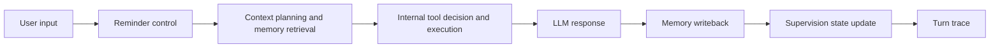

# Workmate Agent

Workmate Agent 是一个面向个人学习和工作执行的长期工位搭子。它不是一次性问答助手，而是通过本地记忆记录用户的任务汇报、模型回复和时间线，在连续对话中判断进度、提醒偏航、整理任务结构。

当前项目重点解决一个问题：让大模型 API 调用具备可持续的上下文记忆，并能在命令行和 Web 页面里进行连续对话。

## 项目愿景

Workmate Agent 的长期愿景，是成为一个能陪用户持续行动的个人自律 Agent。它不只是回答问题，而是长期记住用户的目标、任务、承诺和执行节奏，在合适的时候温和提醒偏航、帮助用户收束注意力、推动任务闭环。

理想状态下，它应该像一个长期坐在旁边的工位搭子：既能帮助用户集中注意力完成当下任务，也能在更长周期里观察行为模式，减少拖延、分心和过度规划，让用户更稳定地提高生产力、专注度和生活自律性。

后续功能迭代路线见 [ROADMAP.md](ROADMAP.md)。如果目标是把项目作为简历中的 Agent 工程项目展示，后续开发顺序见 [docs/DEVELOPMENT_PLAN.md](docs/DEVELOPMENT_PLAN.md)。

## 项目背景

目标用户是容易拖延、注意力分散，或者刚开始推进一个项目但缺少外部监督的人。用户可以把当天目标、当前进展、卡住的问题告诉 Agent；Agent 会结合历史记录判断用户是否真的在推进，而不是只根据单次消息给出泛泛建议。

典型场景：

- 求职准备：收集 JD、提炼高频技能词、推进作品集或项目
- 学习监督：汇报学习进度，识别过度输入和伪努力
- 任务执行：把模糊目标拆成下一步可执行动作
- 长期复盘：基于历史记录观察任务推进和时间投入是否匹配

## 功能

- 连续对话：命令行启动后可以多轮输入，直到用户主动退出
- 本地记忆：每轮用户输入和 Agent 回复都会保存到 `memory/data/records.json`
- 上下文注入：下一轮调用模型前，会读取最近几轮对话并生成长期记忆摘要
- 统一记忆项：V0.5 起会把任务、进展、阻塞、承诺、用户偏好和监督模式沉淀到 `memory/data/memory_items.json`
- 三层记忆模型：V0.5.1 起增加 `Resource / MemoryItem / MemoryCategory`，分别追踪原始来源、原子记忆和分类摘要
- 语义压缩：V0.5.2 起把原始对话提炼为 `semantic_dialogues`，上下文注入优先使用核心语义以节省窗口
- 自我反省：V0.5.2 起每若干轮对话或用户手动要求复盘时，提炼高阶洞察并记录反省结果
- 记忆治理：识别陈旧/冲突事实，对旧记忆降权或归档，而不是直接删除
- 记忆流水线：每轮对话统一经过提取、任务更新、记录保存、记忆项写入和索引刷新
- 流水线契约：每个记忆阶段都有 `requires / produces` 诊断信息，方便定位提取、保存、索引等故障
- 任务生命周期：把任务从当前快照升级为 `inbox / planned / active / blocked / done / abandoned` 的完整状态流，并支持主任务下的子任务
- 上下文规划：根据用户输入选择注入任务、摘要、承诺、统一记忆项或相关历史，减少每轮全量上下文
- 上下文压缩：系统记忆和最近对话分别控制预算，避免长对话让模型上下文膨胀
- Hybrid Memory RAG：V1.5 起用 `MemoryRetriever` 对长期记忆进行可解释召回，综合关键词、近期性、重要性、记忆类型权重和可选向量相似度，并输出召回来源和评分原因
- Evaluation Suite：V1.7 起提供不依赖真实 API Key 的固定评估集，覆盖记忆召回、任务状态、承诺、提醒控制、工具调用、上下文规划和监督事件生命周期
- 自动化测试与 CI：V1.8 起引入 pytest 与 GitHub Actions，自动运行语法检查、单元测试和 eval smoke test
- 智能陪伴与屏幕双向状态流转监测：V1.9 起引入 `screen_accompaniment` 陪伴鼓励事件与配套本地规则和 Vision 鼓励文案生成，支持专注工作与娱乐偏航状态转换时自动解决（resolve）旧事件并注入陪伴提醒/警报，支持多模态分离 API 配置、免控制权限频繁弹窗、自定义黑白名单预过滤绕过 Vision、中转 API 防火墙 (Cloudflare WAF) 浏览器 User-Agent 伪装绕过，大模型配置下优先调用 Vision 分析并以本地黑白名单规则作为无缝降级兜底方案，以及前端 Preferences 面板配置折叠交互可视化。
- 主动监督信号：根据任务停滞、未关闭承诺、反复阻塞和任务过散生成监督提醒
- 支持性知识层：V0.6 起在用户焦虑、分散、拖延、疲惫、卡住或准备执行学习任务时，按需注入轻量方法论卡片
- 内部状态工具层：V0.7 起支持受控工具调用，用于读取和更新任务、承诺、记忆等 Workmate 内部状态
- Agent Runtime 与运行轨迹：V1.4 起把每轮对话显式拆成提醒控制、上下文规划、工具执行、模型回复和记忆写回，并生成 `turn_trace` 用于 Web/API 调试
- 工具调用工程化：V1.6 起为内部工具补齐输入输出 schema、读写边界、副作用标注和执行耗时，`MODEL CONTEXT` 可展示本轮 `TOOL TRACE`
- 专注会话：V0.8 起支持记录用户“离开对话后要执行的一段任务”，追踪当前专注、计划时长、实际经过时间和最近会话间隔
- 承诺 deadline：V0.8.1 起自动识别承诺中的时间词（今天/明天/这周等），标注逾期和今日到期的承诺，监督信号优先提醒时效性最高的未关闭事项
- 行为统计：V0.8.1 起聚合专注会话完成率、累计专注时长、承诺履行率、连续活跃天数等量化指标，注入 AI 上下文以支持更具体的进度感知
- 行为模式分析：V1.1 起从任务、专注、承诺和监督事件中提炼长期行为模式，帮助 Agent 识别任务分散、承诺积压、专注超时和提醒摩擦等趋势
- 个人自律仪表盘：V1.2 起在 Web 顶部聚合今日专注、完成任务、未关闭承诺、当前主线、本周节奏和轻量行动建议
- 时间情境感知：V0.8.1 起根据当前时段（上午/下午/傍晚/深夜）调整上下文注入策略；深夜自动屏蔽监督信号，避免加压
- 早间简报与时境复盘：V0.8.2 起在每日首次交流时自动注入“早间简报”，引导温和启动；在傍晚收工时自动触发“纯自然语言晚间复盘”，以极具同理心的对话暖心告别，不带问题、列表或表格，极轻交互；若离开对话超 30 分钟或专注超时，注入静默间隔与超时时间指引 Agent 柔和问询
- 桌面弹窗提醒：V0.8.3 起支持在专注会话超时或有今天到期/逾期承诺时，通过浏览器桌面通知主动弹窗提醒，并利用 localStorage 自动进行防重复过滤
- 后台常驻推送与离线通知：V0.8.4 起在 Web 后台挂载常驻守护线程（Scheduler），当专注会话超时或有今天到期/逾期承诺时，即使浏览器关闭，也能通过 macOS 系统通知、Bark（iOS 手机弹窗）或飞书群机器人推送将提醒即时送达用户
- 周度自律诊断报告 (Weekly Review)：V0.8.5 起支持根据过去 7 天的专注会话数据、承诺履约表现以及长期行为模式洞察，为用户自动生成一份极具诊断价值的 Markdown 周报。支持自然语言（如：“周报”、“周复盘”等）触发，提供数据概览表格、注意力诊断、长期拖延预警以及轻量自律指南，以极其亲和温暖、平等的语气与用户对话，无交互摩擦，自然收尾。
- Web 界面视觉美化与推送自检：V0.8.6 起支持加载 marked.js 与 Prism.js，实现 100% 完美的 Markdown 格式化排版（含周报表格美化）、代码块语法高亮及悬浮一键复制代码。在侧边栏底部新增“系统配置与推送自检”折叠面板，动态展示多通道通知的启用与配置状态，并支持一键发送测试推送以自检连通性。
- 可视化待办列表：V0.9.0 起在 Web 左侧 `EXECUTION` 面板中展示从对话提取出的任务，支持点击任务直接标记完成或重新激活，并同步更新任务生命周期与当前任务状态
- 任务去重优化：V0.9.2 起使用 Jaccard 相似度匹配任务标题，减少因语序颠倒、中文助词或修饰语不同造成的重复 Todo
- 监督事件闭环：V1.0 起将专注超时、承诺到期、任务停滞等提醒统一记录为监督事件，支持确认、稍后提醒、静音和关闭，减少重复打扰
- 状态联动：V1.0 起监督事件执行 `DONE` 时可同步收束关联的专注会话、关闭到期承诺或完成久未更新任务
- 提醒偏好：V1.0 起支持设置默认稍后提醒时间、推送最低等级、静默时段，以及按专注/承诺/任务停滞分别启停提醒
- 自适应提醒策略：V1.3 起根据用户对提醒的确认、关闭、稍后和静音反馈生成策略建议，用户点击后才应用；当用户处于焦虑、疲惫、分散、卡住或休息时段时，会自动建议降低监督语气；监督事件文案也会参考长期用户画像中的沟通偏好，优先保持低压力、短句和不要求证明；页面、浏览器通知、后台/手机推送可以分别设置提醒门槛；不同监督事件类型也会根据长期反馈单独调整主动推送门槛；也支持“今天安静一点”“只提醒承诺”“恢复提醒”等自然语言控制，并对提醒/通知/推送相关表达进行 LLM 优先分类、规则兜底
- 时间感：当前输入会附带当前时间，历史输入会附带历史记录时间
- 进度监督：Agent 关注任务进展、偏航和伪努力；多任务场景会用无序列表帮用户理顺主任务和子任务，但不会主动提供技术路线或设置时间限制
- 角色边界：Agent 负责总体规划和监督，不负责替用户解释技术细节、设计专业方案或完成任务

## Agent Loop

V1.4 起，Workmate Agent 的每轮对话会经过统一的 `AgentRuntime`，并生成 `turn_trace` 供 Web/API 调试。



`turn_trace` 只记录工程执行过程，例如阶段耗时、上下文规模、工具调用结果和记忆写回状态，不展示模型隐藏推理链。

## 项目结构

```text
workmate-agent/
├── agent/
│   ├── runtime.py         # v1.4 Agent Runtime 和 turn_trace 生成
│   └── __init__.py
├── memory/
│   ├── manager.py         # 记忆读写、摘要和上下文组装入口
│   ├── store.py           # 资源层、统一记忆项、分类摘要
│   ├── interpreter.py     # 提取、语义压缩、摘要、洞察、意图识别
│   ├── task_state.py      # 任务、当前状态、承诺聚合入口
│   ├── context_engine.py  # 检索、上下文规划、上下文压缩聚合入口
│   ├── retriever.py       # v1.5 Hybrid Memory RAG 评分与召回解释
│   ├── reflection.py      # v0.5.2 自我反省触发和记录
│   ├── governance.py      # v0.5.2 陈旧/冲突记忆治理
│   ├── pipeline.py        # v0.5 每轮对话记忆写入流水线
│   ├── context_compressor.py # v0.5 上下文预算和压缩
│   ├── context_planner.py # 根据当前输入选择需要注入的上下文
│   ├── commitment.py      # 承诺和未关闭待办追踪
│   ├── profile.py         # 长期用户画像
│   ├── search.py          # 轻量关键词历史检索
│   ├── supervision.py     # v0.5 主动监督信号（含逾期承诺感知）
│   ├── support_knowledge.py # v0.6 支持性知识层检索
│   ├── focus_session.py   # v0.8 专注会话和时间间隔感知
│   ├── stats.py           # v0.8.1 行为统计聚合（专注/承诺/活跃度）
│   ├── behavior_patterns.py # v1.1 行为模式分析
│   ├── dashboard.py       # v1.2 个人自律仪表盘聚合
│   ├── supervision_events.py # v1.0 可追踪监督事件
│   ├── task_manager.py    # v0.4.2 任务/子任务生命周期和事件流水
│   ├── task_state_manager.py # 当前任务状态维护
│   ├── paths.py           # 运行时记忆数据目录配置
│   ├── __init__.py
│   └── data/              # 运行时记忆文件，默认不提交
│       ├── records.json
│       ├── memory_resources.json
│       ├── memory_items.json
│       ├── memory_categories.json
│       ├── semantic_dialogues.json
│       ├── high_level_insights.json
│       ├── memory_conflicts.json
│       ├── reflections.json
│       ├── tasks.json
│       ├── task_events.json
│       ├── task_state.json
│       ├── commitments.json
│       ├── user_profile.json
│       ├── retrieval_index.json
│       ├── focus_sessions.json
│       ├── behavior_patterns.json
│       ├── supervision_events.json
│       ├── supervision_preferences.json
│       └── daily_summaries/
├── knowledge/
│   └── support_notes.json # 注意力、学习、时间管理和情绪调节短卡片
├── tools/
│   ├── registry.py        # 内部工具注册表
│   ├── executor.py        # 结构化工具调用执行器和 tool trace
│   └── workmate_tools.py  # 任务、承诺、记忆等内部状态工具
├── evals/
│   ├── cases.json         # v1.7 固定评估用例
│   ├── run_eval.py        # v1.7 可复现评估 runner
│   └── reports/           # 本地评估报告输出目录，报告文件默认不提交
├── tests/                 # v1.8 pytest 测试
├── .github/workflows/
│   └── ci.yml             # v1.8 GitHub Actions
├── src/
│   ├── LLMClient.py       # 大模型 API 客户端
│   ├── core.py            # WorkmateAgent 和命令行连续对话入口
│   └── web.py             # 本地 Web 调试服务
├── web/
│   ├── assets/
│   └── index.html         # 前端调试界面
├── demo.md                # 示例交互
├── ROADMAP.md             # 面向长期愿景的功能迭代路线
├── requirements.txt
└── README.md
```

## 环境准备

### 快速启动

```bash
git clone https://github.com/fcsfang/workmate-agent.git
cd workmate-agent
cp .env.example .env
```

打开 `.env`，填写你的模型 API 配置。OpenRouter 示例：

```env
LLM_MODEL_ID=moonshotai/kimi-k2.6:free
LLM_API_KEY=your-api-key-here
LLM_BASE_URL=https://openrouter.ai/api/v1
```

然后运行：

```bash
./run.sh
```

脚本会自动：

- 检查 `.env` 是否存在
- 检查 `LLM_API_KEY` 是否已填写
- 优先使用本机已有的 conda `agent` 环境
- 如果没有 conda `agent` 环境，则创建本地 `.venv`
- 安装/检查依赖
- 启动 Web 服务
- 自动打开浏览器访问 `http://127.0.0.1:7860`

保持运行 `./run.sh` 的终端窗口即可持续使用页面和 API。需要停止时，在该终端按 `Ctrl+C`。

`.env` 不应提交到 Git。

## 运行方式

### 推荐方式

当前推荐入口是 `src.web`。启动它以后，整个项目就跑起来了：本地前端页面、`/api/chat` 对话接口、`/api/memory` 记忆接口会一起启动。

推荐使用前端界面调试连续对话：

```bash
./run.sh
```

启动后打开：

```text
http://127.0.0.1:7860
```

页面会显示对话区、最近记忆、记忆摘要和本地记录数量。每次发送消息都会调用同一个 `WorkmateAgent` 流程，并写入 `memory/data/records.json`。

0.5.2+ 版本还会在页面左侧显示当前任务生命周期、子任务、最近 7 天摘要、未关闭承诺、长期用户画像、统一记忆项、记忆分类、高阶洞察、语义压缩和主动监督信号，并提供 `MODEL CONTEXT` 调试区。V0.8 起，左侧还可以直接开始、完成或停止一段专注会话，用来记录用户离开聊天后实际去做的那段任务；该状态会进入上下文，但不会作为强制考核。V0.9.0 起，左侧新增了可视化待办列表（TODO LIST），将模型在对话中提炼的任务进行集中可视化展示，并支持点击直接同步状态（如打勾完成）。V1.0 起，`SUPERVISION EVENTS` 会把专注超时、承诺到期和任务停滞变成可确认、可稍后提醒、可静音、可关闭的事件；当用户点击 `DONE` 时，会尝试同步收束关联的专注会话、承诺或任务，并保留反馈统计。V1.1 起，`MEMORY` 面板会展示行为模式摘要，例如任务分散、承诺积压、专注超时或提醒摩擦，帮助 Agent 逐步从单次提醒走向长期节奏观察。V1.2 起，`EXECUTION` 顶部新增 `TODAY DASHBOARD`，集中展示今日专注、今日完成、未关闭承诺、当前主线、本周节奏和一条轻量建议，并提供快速开启专注、完成当前任务和查看提醒的入口。V1.3 起，提醒偏好区会根据用户对提醒的反馈生成自适应策略建议，例如更安静地推送或延长默认稍后提醒间隔；如果当前输入透露出焦虑、疲惫、分散、卡住，或系统处在深夜/清晨休息时段，策略卡片会显示 `tone_policy`，建议模型和推送一起放轻；如果长期用户画像里记录了沟通偏好，策略卡片会显示 `copy_policy`，事件卡片和通知会优先使用更自然的 `display_message`；页面内列表、浏览器通知、后台/手机推送分别使用 `page_min_severity`、`browser_min_severity`、`background_min_severity`，避免所有渠道同频打扰；如果某类事件经常被稍后或静音，策略卡片会显示 `type_preference_signals`，并通过 `event_type_min_severity` 只调整这一类提醒。V1.4 起，`MEMORY` 面板会展示最近一轮 `runtime` 摘要，`/api/memory` 和 `/api/context` 也会返回完整 `turn_trace`，用于观察 Agent Loop 的阶段、耗时、上下文规模、工具调用和记忆写回状态。V1.5 起，`MODEL CONTEXT` 顶部会展示本轮 Hybrid Memory RAG 的召回计划、top results、分数拆解和原因，方便检查长期记忆为什么被带入模型上下文。V1.6 起，`MODEL CONTEXT` 也会展示本轮 `TOOL TRACE`，包括工具读写模式、调用原因、耗时、错误和副作用；`/api/context` 同时返回 `tool_schemas`，可用于审阅内部工具边界。所有建议需要用户点击 `APPLY STRATEGY` 后才会写入偏好。用户也可以直接说“今天安静一点”“只提醒承诺”“恢复提醒”等短句来调整提醒边界；当表达不完全匹配固定短语但明显在谈提醒/通知/推送时，系统会先用 LLM 分类，再用规则兜底。每日摘要会优先调用模型生成 JSON 记忆，失败时退回规则摘要；`MODEL CONTEXT` 会展示上一轮实际发送给模型的 messages、上下文规模、检索计划和流水线状态，方便检查 Agent 到底带入了哪些记忆。

只要这个命令所在的终端窗口保持运行，页面和 API 就会保持可用。需要停止时，在该终端按 `Ctrl+C`。

### 手动启动 Web

如果你已经准备好 conda 中名为 `agent` 的环境，也可以手动运行：

```bash
conda run -n agent python -m src.web
```

或者先激活环境：

```bash
conda activate agent
pip install -r requirements.txt
python -m src.web
```

### 命令行模式

也可以在项目根目录运行：

```bash
conda run -n agent python -m src.core
```

启动后可以连续输入消息。输入 `exit`、`quit`、`q`、`退出` 或 `结束` 可以结束对话。

## 测试与评估

运行 pytest：

```bash
conda run -n agent pytest
```

基础语法检查：

```bash
conda run -n agent python -m py_compile agent/*.py memory/*.py src/*.py tools/*.py tests/*.py
```

运行完整评估集：

```bash
conda run -n agent python evals/run_eval.py
```

评估会在 `evals/reports/` 下生成 JSON 和 Markdown 报告。报告文件默认被 `.gitignore` 忽略，避免每次运行都产生版本库噪音。

GitHub Actions 会在 push 和 pull request 时自动运行：

- Python syntax check
- `pytest`
- `python evals/run_eval.py --report-dir /tmp/workmate-eval-reports --min-score 1.0`

## 示例对话

```text
你：我现在已经找了1条JD，并且已经放到文档中了

搭子：好，已经开始落地了。先确认两个事：高频词标出来了吗，还是只复制了原文？如果只复制了原文，下一步不要继续扩散，先把这1条里的 RAG、Agent、Python、评测这些关键词圈出来。

你：我现在完成了10条JD拉取了，现在请你根据你的记忆，总结我的进展

搭子：我会先看时间线和历史记录。你确实从“准备找JD”推进到了“完成拉取”。现在别急着扩展新目标，先把完成范围说清楚：是只有岗位信息，还是完整JD文本和高频词已经标注？下一步先整理前5个高频词及出现次数，这比继续找更多岗位更有价值。
```

更完整的真实交互案例见 [demo.md](demo.md)。

## 代码调用

如果不使用命令行，也可以在代码中单轮调用：

```python
from src.core import WorkmateAgent

agent = WorkmateAgent()
response = agent.invoke("我现在开始找第一个大模型实习JD")
print(response)
```

## 当前边界

当前版本是 JSON 文件记忆，适合早期验证连续对话、任务生命周期、统一记忆项、专注监督和可视化 Todo 闭环。V1.9 已经具备 Resource / MemoryItem / MemoryCategory 三层结构、语义压缩、高阶洞察、自我反省、记忆治理、Hybrid Memory RAG、检索计划、流水线契约、上下文压缩、主动监督信号、内部状态工具、schema-driven tool calling、tool trace、Agent Runtime、turn_trace、Evaluation Suite、pytest、GitHub Actions CI、专注会话、承诺 deadline、行为统计、行为模式分析、个人自律仪表盘、提醒策略建议、LLM 优先自然语言提醒控制、压力/低能量感知语气策略、长期画像驱动提醒文案、分渠道提醒门槛、事件类型反馈策略、早间简报、时间间隔感知、纯自然语言晚间总结复盘、前端弹窗提醒、后台守护线程常驻推送、周度自律诊断报告、Markdown 增强渲染、推送自检、可视化 Todo 列表、任务相似度去重、可追踪监督事件、提醒偏好配置、监督反馈统计、监督事件到专注/承诺/任务的轻量状态联动、智能陪伴鼓励、多模态分离 API 支持、免 App 权限弹窗、自定义黑白名单绕过 Vision 过滤、中转 API 防火墙伪装绕过、Vision 大模型检测优先与本地降级兜底，以及前端 Preferences ⚙️配置面板折叠交互。

后续记录变多后，可以继续加入更稳定的向量检索、更细粒度的行为模式分析、跨设备数据同步，以及更成熟的长期自律报告与主动陪伴策略。
